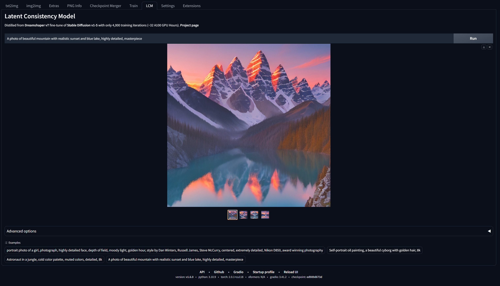

# Latent Consistency Model for Stable Diffusion WebUI



This extension aims to integrate [Latent Consistency Model (LCM)](https://latent-consistency-models.github.io/) into [AUTOMATIC1111 Stable Diffusion WebUI](https://github.com/AUTOMATIC1111/stable-diffusion-webui).

Note that LCMs are a completely different class of models than Stable Diffusion, and the only available checkpoint currently is [LCM_Dreamshaper_v7](https://huggingface.co/SimianLuo/LCM_Dreamshaper_v7).

**This is a very barebone implementation written in an hour, so any PRs are welcome.**

## Installation:

Simply clone this repo to your `extensions/` directory:

```
git clone https://github.com/0xbitches/sd-webui-lcm
```

Or go to "Extensions->Install from URL".

Then reload your WebUI.

Generated images will be saved to `outputs/txt2img-images/LCM`. You can use PNG Info to examine generation data.

## Known Issues

#### 1. `ValueError: Non-consecutive added token '<|startoftext|>' found. Should have index 49408 but has index 49406 in saved vocabulary.`

To resolve this, locate your huggingface hub cache directory.

It will be something like `~/.cache/huggingface/hub/path_to_lcm_dreamshaper_v7/tokenizer/`. On Windows, it will roughly be `C:\Users\YourUserName\.cache\huggingface\hub\models--SimianLuo--LCM_Dreamshaper_v7\snapshots\c7f9b672c65a664af57d1de926819fd79cb26eb8\tokenizer\`.

Find the file `added_tokens.json` and change the contents to:

```
{
  "<|endoftext|>": 49409,
  "<|startoftext|>": 49408
}
```

or simply remove it.
