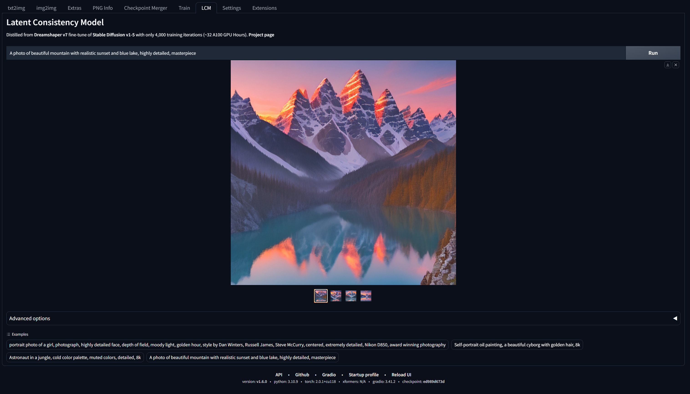
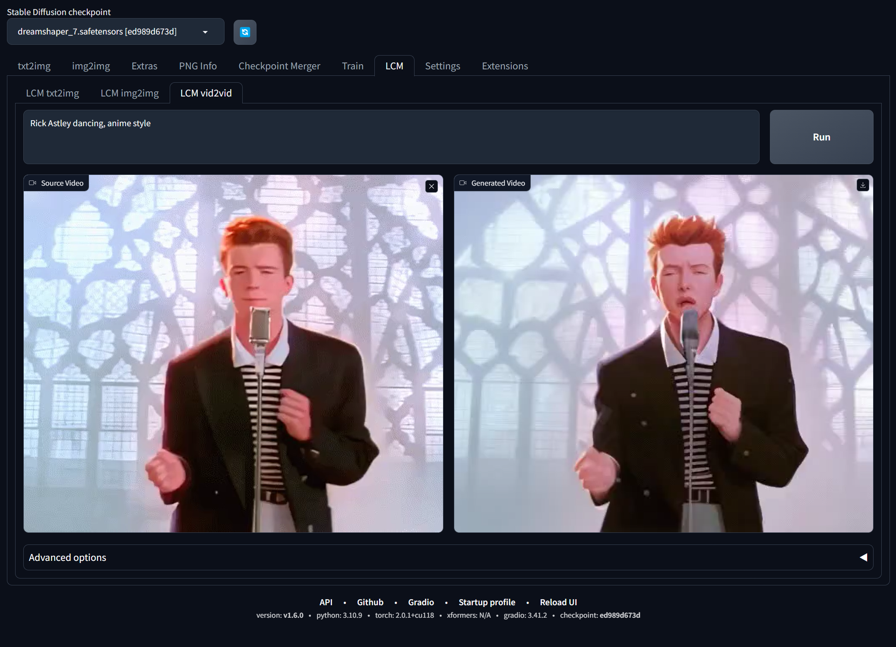

# Latent Consistency Model for Stable Diffusion WebUI <!-- omit from toc -->



This extension aims to integrate [Latent Consistency Model (LCM)](https://latent-consistency-models.github.io/) into [AUTOMATIC1111 Stable Diffusion WebUI](https://github.com/AUTOMATIC1111/stable-diffusion-webui).

Note that LCMs are a completely different class of models than Stable Diffusion, and the only available checkpoint currently is [LCM_Dreamshaper_v7](https://huggingface.co/SimianLuo/LCM_Dreamshaper_v7).

**This is a very barebone implementation written in an hour, so any PRs are welcome.**

## Table of Contents <!-- omit from toc -->

- [Installation:](#installation)
- [Img2Img / Vid2Vid](#img2img--vid2vid)
- [Known Issues](#known-issues)
  - [1. Can't Find 'LCM' tab or `ImportError: cannot import name 'xxx' from 'diffusers.xxx'`](#1-cant-find-lcm-tab-or-importerror-cannot-import-name-xxx-from-diffusersxxx)
  - [2. `ValueError: Non-consecutive added token '<|startoftext|>' found. Should have index 49408 but has index 49406 in saved vocabulary.`](#2-valueerror-non-consecutive-added-token-startoftext-found-should-have-index-49408-but-has-index-49406-in-saved-vocabulary)
  - [3. `torch.cuda.OutOfMemoryError...`](#3-torchcudaoutofmemoryerror)

## Installation:

Simply clone this repo to your `extensions/` directory:

```
git clone https://github.com/0xbitches/sd-webui-lcm
```

Or go to "Extensions->Install from URL".

Then reload your WebUI.

Generated images will be saved to `outputs/txt2img-images/LCM`. You can use PNG Info to examine generation data.

## Img2Img / Vid2Vid



Img2Img/Vid2Vid with LCM is now supported in A1111. Simply update your extension and you should see the extra tabs.

Note that for these features, output height and width will be the same as input, and currently not changeable.

Generated videos will be saved to `outputs/LCM-vid2vid`.

## Known Issues

#### 1. Can't Find 'LCM' tab or `ImportError: cannot import name 'xxx' from 'diffusers.xxx'`

This is usually due to the installed version of `diffusers` in your `venv` is not up-to-date.

To check the version you have, go to `stable-diffusion-webui/venv/Scripts` and run the activate script (`Activate.ps1` on Windows).

Then, run `pip show diffusers` to see the version installed.

To upgrade `diffusers` to the latest version, run `pip3 install --upgrade diffusers`.

If the problem still persists, then you likely have an extension that force installs an old version of `diffusers`.

[EasyPhoto](https://github.com/aigc-apps/sd-webui-EasyPhot), for example, force installs `diffusers=0.18.2`.

#### 2. `ValueError: Non-consecutive added token '<|startoftext|>' found. Should have index 49408 but has index 49406 in saved vocabulary.`

To resolve this, locate your huggingface hub cache directory.

It will be something like `~/.cache/huggingface/hub/path_to_lcm_dreamshaper_v7/tokenizer/`. On Windows, it will roughly be `C:\Users\YourUserName\.cache\huggingface\hub\models--SimianLuo--LCM_Dreamshaper_v7\snapshots\c7f9b672c65a664af57d1de926819fd79cb26eb8\tokenizer\`.

Find the file `added_tokens.json` and change the contents to:

```
{
  "<|endoftext|>": 49409,
  "<|startoftext|>": 49408
}
```

or simply remove it.

#### 3. `torch.cuda.OutOfMemoryError...`

This is because Automatic1111 loads an SD checkpoint on top of LCM.

Try Settings -> Actions -> Unload SD checkpoint to free VRAM
